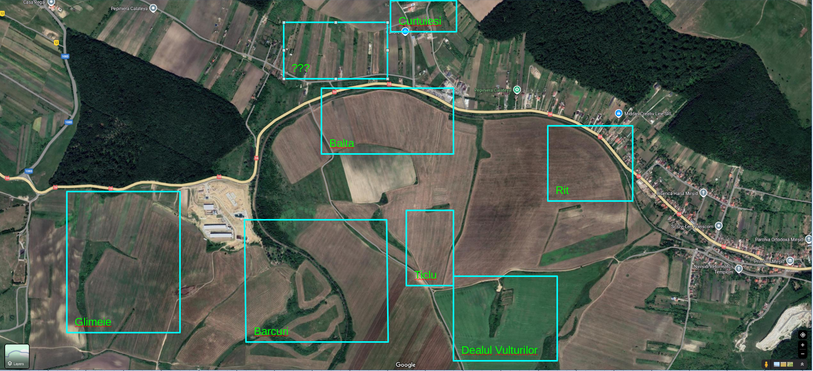

# Terenuri Mirsid

1. [Sumar](#sumar)
1. [Glimeie](#glimeie)
1. [Barcuri](#barcuri)
1. [Curtuiesi](#curtuiesi)
1. [Balta](#balta)
1. [Rit](#rit)
1. [Sub Grajduri](#sub-grajduri)
1. [Rit](#rit)
1. [Roba](#roba)
1. [Ticlu](ticlu)
1. [La zvulturi](#la-zvulturi)

## Sumar

| Zona       | Parcela   | Suprafata          | Titlu   | Intabulare  | Comentarii |
|:-----------|:----------|:------------------ |:--------|:------------|:------------|
| Glimeie    |         1 |  5800mp (1 Juger)  |    DA   |     nu      | ⚠️ in faza de intabulare, neclaritati delimitare |
| Glimeie    |         2 |  5800mp (1 Juger)  |    NU   |     nu      | ❗ contract vanzare cumparare de mana, de facut acte finala |
| Glimeie    |         3 |  5800mp (1 Juger)  |    DA   |     nu      | ⚠️ in faza de intabulare, necaritati delimitare |
| **Sumar Glimeie** |   **3 parcele** | **total 17400mp (3 Jugere)**  |||| 
| Barcuri    |           |                    |         |             |            |         

## Glimeie

## Barcuri

## Curtuiesi

## Balta

## Sub Grajduri

## Rit

## Roba

## Ticlu

## La zvulturi
